# Plan de développement des scripts de mise à jour de données

Ce document décrit le plan de développement de trois scripts Python pour automatiser la mise à jour des fichiers de données COHOR et NM.

## 1. Objectif général

L'objectif est d'automatiser la mise à jour des fichiers JavaScript (`.js`) contenant les données COHOR (été et hiver) et les prédictions NM, en utilisant les fichiers de données les plus récents (`.csv` et `.txt`).

## 2. Diagramme du flux de travail

```mermaid
graph TD
    subgraph Script COHOR Hiver
        A1["Recherche du fichier CSV hiver le plus récent dans <br> C:\\...\\COHOR\\LFLL"] --> A2["Lecture du contenu CSV"];
        A2 --> A3["Mise à jour de la variable <br> window.winterCohorDataCSV"];
        A3 --> A4["Écriture dans winter_cohorData.js <br> à C:\\...\\aiglon_démo"];
    end

    subgraph Script COHOR Été
        B1["Recherche du fichier CSV été le plus récent dans <br> C:\\...\\COHOR\\LFLL"] --> B2["Lecture du contenu CSV"];
        B2 --> B3["Mise à jour de la variable <br> window.summerCohorDataCSV"];
        B3 --> B4["Écriture dans summer_cohorData.js <br> à C:\\...\\aiglon_démo"];
    end

    subgraph Script NM Predict
        C1["Boucle pour les fichiers predict_j0.txt à predict_j4.txt <br> dans C:\\...\\NM B2B\\LOAD"] --> C2["Lecture du contenu du fichier .txt"];
        C2 --> C3["Remplacement des données brutes dans le <br> fichier nmpredictjXData.js correspondant"];
        C3 --> C4["Écriture dans les fichiers nmpredict respectifs <br> à C:\\...\\aiglon_démo"];
    end
```

## 3. Spécifications des scripts

### Script 1 : `update_winter_cohor.py`

- **Objectif :** Mettre à jour `winter_cohorData.js`.
- **Bibliothèques requises :** `os`, `glob`.
- **Logique :**
  1.  Définir les chemins source et destination en début de script pour une modification facile.
  2.  Scanner le répertoire source (`C:\\Users\\alexandre.gigante\\OneDrive - DGAC\\PlanifCharge\\COHOR\\LFLL`) pour les fichiers correspondant au motif `*_LYS_W*.csv`.
  3.  Extraire les dates des noms de fichiers et identifier le plus récent.
  4.  Lire le contenu du fichier CSV le plus récent.
  5.  Échapper les backticks (\`) dans le contenu CSV pour éviter les conflits avec les template literals JavaScript.
  6.  Lire le fichier `winter_cohorData.js`.
  7.  Utiliser une expression régulière pour remplacer le contenu de `window.winterCohorDataCSV` par les nouvelles données.
  8.  Écrire le contenu mis à jour dans `winter_cohorData.js` dans le répertoire de destination (`C:\\Users\\alexandre.gigante\\Documents\\aiglon_démo`).

### Script 2 : `update_summer_cohor.py`

- **Objectif :** Mettre à jour `summer_cohorData.js`.
- **Bibliothèques requises :** `os`, `glob`.
- **Logique :** Identique au script d'hiver, mais en ciblant les fichiers `*_LYS_S*.csv` et en mettant à jour le fichier `summer_cohorData.js`.

### Script 3 : `update_nm_predict.py`

- **Objectif :** Générer les 5 fichiers `nmpredictjXData.js`.
- **Bibliothèques requises :** `os`, `re`.
- **Logique :**
  1.  Définir les chemins source et destination.
  2.  Effectuer une boucle de `i` de 0 à 4.
  3.  Dans la boucle :
      a.  Lire le contenu de `predict_j{i}.txt`.
      b.  Lire le fichier `nmpredictj{i}Data.js` existant pour servir de modèle.
      c.  Identifier dynamiquement le nom de la variable (ex: `nmPredictRawData`, `nmPredictj1RawData`) à l'aide d'une expression régulière.
      d.  Remplacer le contenu de cette variable par les données du fichier `.txt`.
      e.  Sauvegarder le fichier mis à jour.